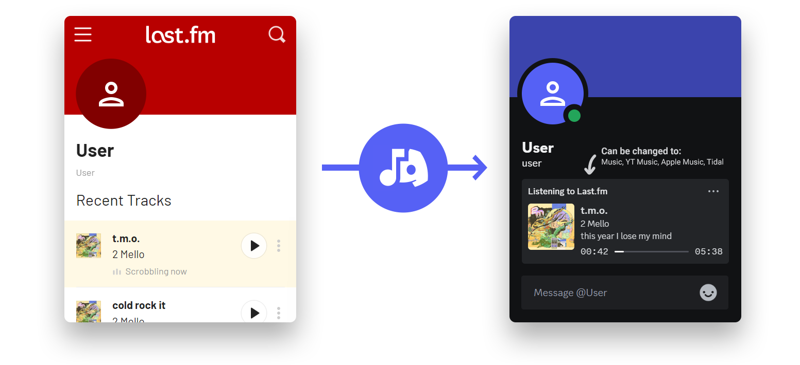
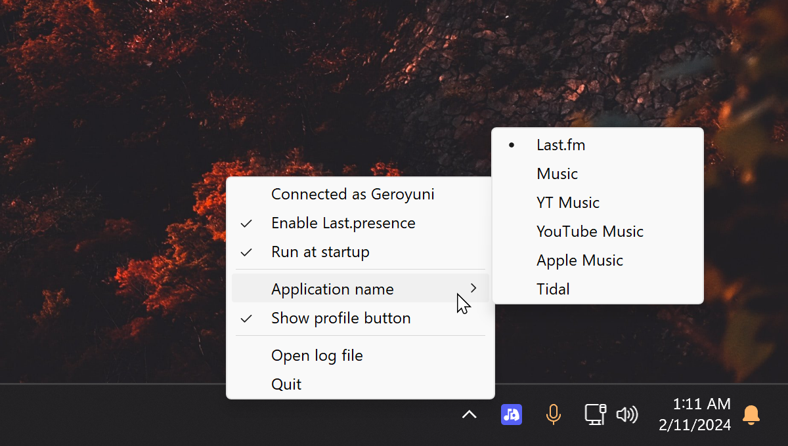

# Last.presence
This is a python script that lets you display what you're currently playing on Last.fm, in your Discord profile, using Discord Rich Presence (RPC). It runs in the background as an icon in your tray bar, and you can make it start with Windows easily.

## What is Last.fm, and why?
Last.fm is a website that lets you track what you listen to. It's versatile in that it can be made to track listens from pretty much anything (using extensions like [Web Scrobbler](https://web-scrobbler.com/) on PC, or phone apps like [Pano Scrobbler](https://play.google.com/store/apps/details?id=com.arn.scrobble)). Discord already lets you show what you're listening to when using Spotify, however, if you use something other than Spotify, there's no built in method to show what you're listening to.

## Requirements
This is made for Windows, because I mainly use Windows.

## How to install and run
* [Download and install Python 3.10+](https://www.python.org/downloads/)
  * Make sure that you select 'Add Python to enviroment variables' during installation
* [Download and unzip the latest version of the script](https://github.com/Geroyuni/Last.presence/archive/refs/heads/main.zip)
* Run `install_requirements.bat` to install some Python requirements
* Run `main.pyw` to run the script

## Interacting with the script
The script runs as a small icon in the tray bar, at the bottom right. You can right-click it to change settings (e.g. hide the profile button, make it run at startup), or open the log file if there are any issues.

