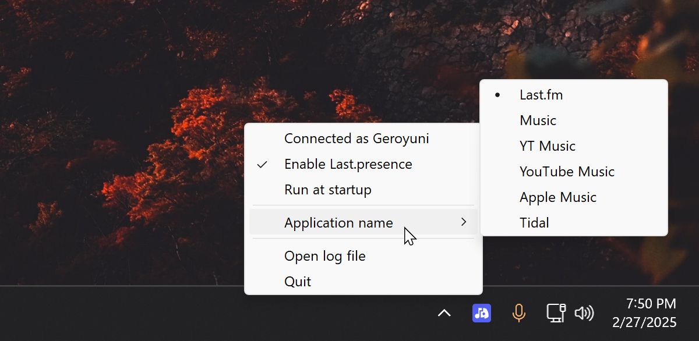

# Last.presence
This is a program that lets you display what you're currently playing on Last.fm, in your Discord profile, using Discord Rich Presence (RPC). It runs in the background as an icon in your tray bar, and you can make it start with Windows easily.

If you don't know what Last.fm is, it's a website that lets you track what you listen to. It's versatile in that it can be made to track listens from pretty much anything (using extensions like [Web Scrobbler](https://web-scrobbler.com/) on PC, or phone apps like [Pano Scrobbler](https://play.google.com/store/apps/details?id=com.arn.scrobble)). Discord already lets you show what you're listening to when using Spotify, however, if you use something other than Spotify, there's no built in method to show what you're listening to.


## How to install
Only available for Windows, because it's what I use.

### Standalone executable (recommended)
[Download the executable](https://github.com/Geroyuni/Last.presence/releases/latest), put in its own folder and run. You are likely to need to skip Windows warnings and whitelist the file in your anti-virus, because the file isn't signed.

### Manual build (mainly for development)
Get [Python 3.10+](https://www.python.org/downloads/), [Git](https://git-scm.com/downloads) and [upx (optional but smaller file, used by pyinstaller)](https://github.com/upx/upx/releases/tag/v4.2.4). Ensure they're all in your environment path, and see commands below. The executable will be put into /dist.
```
git clone https://github.com/Geroyuni/Last.presence.git
cd Last.presence
python -m venv venv
"venv/Scripts/activate"
pip install -r requirements.txt
pyinstaller main.pyw --onefile --name Last.presence --copy-metadata pylast -i "assets/icon.ico" --add-data "assets/icon.ico;."
```

## Interacting with the program
At the start, the program will request your Last.fm username and API. After that, it runs as a small icon in the tray bar, at the bottom right. You can right-click it to change settings (e.g. hide the profile button, make it run at startup), or open the log file if there are any issues.


